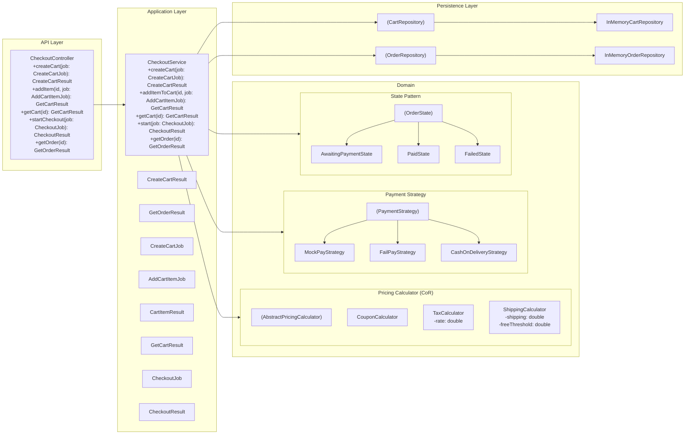
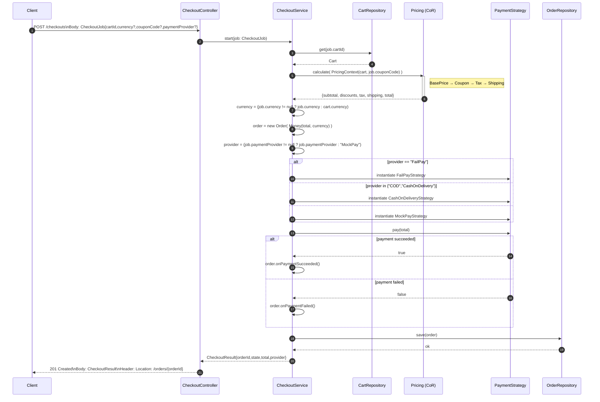

# Checkout API-first Service

## About
A lightweight **checkout service** built with **Java (Spring Boot)**, following clean architecture principles and documented with an **OpenAPI Specification**.  
It demonstrates a modular approach to cart, checkout, payment, and order management with in-memory persistence for easy demo and testing.

---

## ✨ Features
- **Cart Management** – create carts, add items, view contents
- **Checkout Flow** – compute totals with coupons, tax, shipping
- **Order Lifecycle** – track order states (`AwaitingPayment`, `Paid`, `Failed`)
- **Payment Providers** – configurable providers (`MockPay`, `FailPay`, `CashOnDelivery`)
- **API-First** – documented with an **OpenAPI Specification (openapi.yaml)**
- **In-Memory Persistence** – quick demo setup, easily swappable for a database

---

## Project structure
```
checkout-service/
├─ src/main/
│  ├─ java/com/checkoutservice/
│  │  ├─ api/			# API Layer (Controllers / REST endpoints)
│  │  ├─ app/       	# Application Layer (Orchestration)
│  │  │  └─ beans/			# request/response beans
│  │  ├─ domain/		# Core business logic
│  │  │  ├─ cart/
│  │  │  ├─ order/
│  │  │  ├─ pricing/
│  │  │  └─ payment/
│  │  └─ persistence/	# Persistance Layer (Infra / Repository contracts)
│  │
│  ├─ resources/
│  │  ├─ openapi.yaml   # API contract
│  │  └─ application.properties
│  
├─ pom.xml
└─ README.md
```

## Build and Run 
```
mvn clean package
java -jar target/checkout-service.jar
```

Service will be available at http://localhost:8080


## API Quickstart (How to demo - curl)
Example requests using cURL:
```
# 1. Create a cart
curl -X POST http://localhost:8080/carts \
  -H "Content-Type: application/json" \
  -d '{"currency":"USD"}'

# responce: { "cartId": "c_123" }
 
# 2. Add item
curl -X POST http://localhost:8080/carts/c_123/items \
  -H "Content-Type: application/json" \
  -d '{"productId":"sku-101","qty":2,"unitPrice":10.0}'

# 3. View Cart
curl http://localhost:8080/carts/c_123

# 4. Start checkout
curl -X POST http://localhost:8080/checkouts \
  -H "Content-Type: application/json" \
  -d '{"cartId":"c_123","currency":"USD","couponCode":"WELCOME10","paymentProvider":"MockPay"}'

# 4. Get order
curl http://localhost:8080/orders/o_456
```

## Class Diagrams
Using Mermaid

### 1) Component / Layer Diagram


### 2) Class Diagram

```mermaid
classDiagram
%% ===================== API =====================
    class CheckoutController {
        +CheckoutController(service: CheckoutService)
        +createCart(job: CreateCartJob): ResponseEntity~CreateCartResult~
        +addItem(id: String, job: AddCartItemJob): ResponseEntity~GetCartResult~
        +getCart(id: String): ResponseEntity~GetCartResult~
        +startCheckout(job: CheckoutJob): ResponseEntity~CheckoutResult~
        +getOrder(id: String): ResponseEntity~GetOrderResult~
    }

%% ===================== Application (Service + Beans) =====================
    class CheckoutService {
        -carts: CartRepository
        -orders: OrderRepository
        -calculator: PricingCalculator
        +CheckoutService(carts: CartRepository, orders: OrderRepository)
        +createCart(job: CreateCartJob): CreateCartResult
        +addItemToCart(id: String, job: AddCartItemJob): GetCartResult
        +getCart(id: String): GetCartResult
        +start(job: CheckoutJob): CheckoutResult
        +getOrder(id: String): GetOrderResult
    }

%% ---- /app/beans (Requests/Responses) ----
    class CreateCartJob { +currency: String }
    class CreateCartResult { +cartId: String }

    class AddCartItemJob {
        +productId: String
        +qty: int
        +unitPrice: double }

    class CartItemResult {
        +productId: String
        +qty: int
        +unitPrice: double
        +lineTotal: double }
    class GetCartResult {
        +id: String
        +currency: String
        +items: List~CartItemResult~ }

    class CheckoutJob {
        +cartId: String
        +currency: String
        +couponCode: String
        +paymentProvider: String
    }
    class CheckoutResult {
        +orderId: String
        +state: String
        +total: double
        +provider: String }

    class GetOrderResult {
        +id: String
        +amount: double
        +currency: String
        +state: String }

%% ===================== Domain: Cart =====================
    class Money {
        -amount: double
        -currency: String
        +Money(amount: double, currency: String)
        +amount(): double
        +currency(): String
        +plus(o: Money): Money
        +minus(o: Money): Money
        +percent(p: double): Money
    }

    class CartItem {
        +productId: String
        +qty: int
        +unitPrice: Money
        +lineTotal(): Money
    }

    class Cart {
        -id: String
        -currency: String
        -items: List~CartItem~
        +Cart(id: String, currency: String)
        +id(): String
        +currency(): String
        +items(): List~CartItem~
        +add(item: CartItem): void
    }

    class CartRepository {
        <<interface>>
        +create(currency: String): String
        +get(id: String): Cart
        +addItem(id: String, item: CartItem): Cart
    }

%% Ownership
Cart "1" o-- "*" CartItem
CartItem *-- Money

%% ===================== Domain: Order (State) =====================
class Order {
-id: String
-amount: Money
-state: OrderState
+Order(amount: Money)
+getId(): String
+amount(): Money
+stateName(): String
+onPaymentSucceeded(): void
+onPaymentFailed(): void
}

class OrderState {
<<interface>>
+paymentSucceeded(): OrderState
+paymentFailed(): OrderState
+name(): String
}
class AwaitingPaymentState
class PaidState
class FailedState

Order *-- Money
Order *-- OrderState
OrderState <|.. AwaitingPaymentState
OrderState <|.. PaidState
OrderState <|.. FailedState

class OrderRepository {
<<interface>>
+save(order: Order): void
+get(id: String): Order
}

%% ===================== Domain: Pricing (CoR) =====================
class PricingContext {
+cart: Cart
+coupon: String
+subtotal: double
+discounts: double
+tax: double
+shipping: double
+total: double
+PricingContext(cart: Cart, coupon: String)
+finalizeTotals(): void
}

class PricingCalculator {
<<interface>>
+setNext(next: PricingCalculator): PricingCalculator
+calculate(ctx: PricingContext): PricingContext
}

class AbstractPricingCalculator {
#next: PricingCalculator
+setNext(next: PricingCalculator): PricingCalculator
+calculate(ctx: PricingContext): PricingContext
#apply(ctx: PricingContext): void
}

class BasePriceCalculator {
+apply(ctx: PricingContext): void
}
class CouponCalculator {
+apply(ctx: PricingContext): void
}
class TaxCalculator {
-rate: double
+TaxCalculator(rate: double)
+apply(ctx: PricingContext): void
}
class ShippingCalculator {
-shipping: double
-freeThreshold: double
+ShippingCalculator(shipping: double, freeThreshold: double)
+apply(ctx: PricingContext): void
}

PricingCalculator <|.. AbstractPricingCalculator
AbstractPricingCalculator <|-- BasePriceCalculator
AbstractPricingCalculator <|-- CouponCalculator
AbstractPricingCalculator <|-- TaxCalculator
AbstractPricingCalculator <|-- ShippingCalculator

%% ===================== Domain: Payment (Strategy) =====================
class PaymentStrategy {
<<interface>>
+pay(amount: double): boolean
+name(): String
}
class MockPayStrategy
class FailPayStrategy
class CashOnDeliveryStrategy

PaymentStrategy <|.. MockPayStrategy
PaymentStrategy <|.. FailPayStrategy
PaymentStrategy <|.. CashOnDeliveryStrategy

%% ===================== Persistence (In-Memory impls) =====================
class InMemoryCartRepository {
-db: Map~String, Cart~
+create(currency: String): String
+get(id: String): Cart
+addItem(id: String, item: CartItem): Cart
}

class InMemoryOrderRepository {
-db: Map~String, Order~
+save(order: Order): void
+get(id: String): Order
}

CartRepository <|.. InMemoryCartRepository
OrderRepository <|.. InMemoryOrderRepository

%% ===================== Key (minimal) relationships across layers =====================
CheckoutController --> CheckoutService
CheckoutService --> CartRepository
CheckoutService --> OrderRepository
CheckoutService --> PricingCalculator
CheckoutService --> PaymentStrategy

```


### 3) Sequence diagram (Start Checkout)

